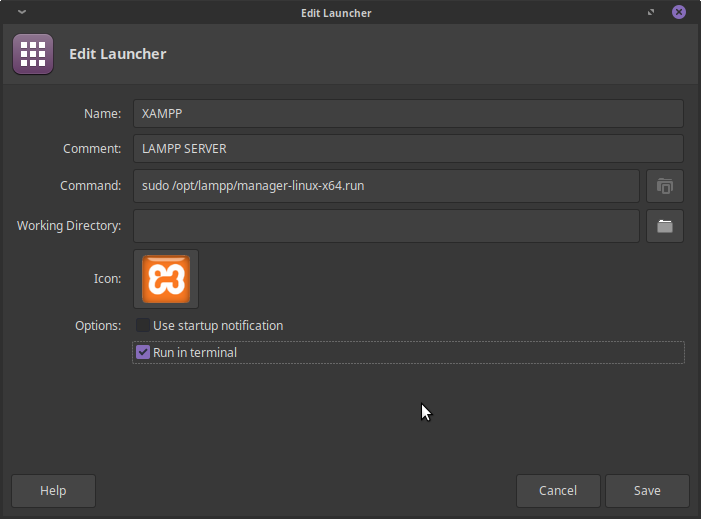
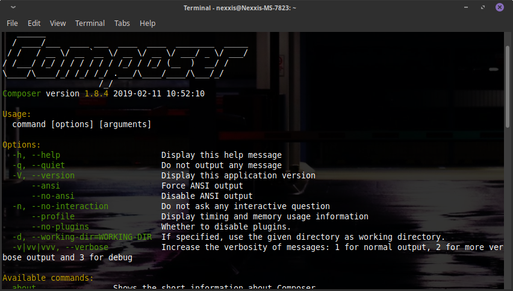

# XAMPP - Composer - Laravel Installation on GNU/Linux

## XAMPP Installation

Firstly you should go and download XAMPP in [apachefriends.org](https://www.apachefriends.org/tr/index.html) then go to download directory.

### First

We should setting up downloaded files to executible.

    chmod +x /xampp-linux-x64-'Your Version'.run

After that,

    sudo ./xampp-linux-x64-'Your Version'.run

When your installation done, now we can change the directory of xampp. Whey we need to change?
Because if we do not change, defined working directory make some difficulty.

Now go to your home directory and generate a folder for setting up to working directory. I prefer 'www' name to this folder. After generation open terminal and go to this directory: 

    cd /opt/lampp/etc

Then use `ls` to list folders and other files. Now use this command to open httpd.conf file

    sudo nano httpd.conf

Change:

    DocumentRoot "/home/'Your User Name'/www"
        <Directory "/home/'Your User Name'/www">

After the change save and quit. 

Now we need to desktop shortcut to acess to XAMPP. In XFCE you can generate shortcut and edit like that:

Note: if you just install XAMPP do not forget to type this command to your terminal after generation to working directory -> `chmod 777 www`

### Well done! XAMPP Installation and configuration done! 

# Composer Installation on XAMPP 

Firstly, open terminal and type:

    sudo nano /etc/environment

 and add

    :/opt/lampp/bin
    
inside to quote than save it.

You can use this command to

    sudo ln -s /opt/lampp/bin/php /usr/local/bin/php

If git and curl not installed your os use this command ->

    sudo apt install git curl

Now we can install Composer

Firstly, use this command

    sudo curl -s https://getcomposer.org/installer | /opt/lampp/bin/php

NOT: You can use this command too! Both are same. 

    sudo curl -sS https://getcomposer.org/installer | php

Finally type this command to your terminal and move to composer.phar file.

    sudo mv composer.phar /usr/local/bin/composer

Now try `composer` it should work in your terminal.

### Well done! Composer Installation done!

# Laravel Installation

This time our job is too easy according to Laravel Website documentation:

Type this command your terminal

    composer global require "laravel/installer=~1.1"

then hit enter!

After installation aaa its nearly to done! Now open XAMPP working directory because time to try generating laravel project. Use the following command and generate project.

    composer create-project --prefer-dist laravel/laravel "Name of the Project"

OWWWW do not forget you should set working directory to 777 but how? Do not worry be Happy :) and use the following command

    chmod -R 777 "Working-Direcory-Name"

Congratulations! Everything Done!

Do not forget to share your firends and give star to repostory!!! :)

Note: When I wrote this file I used these websites. Thank you for who help to community to solve problems and other things.

Websites: 

    For Composer: https://askubuntu.com/questions/604522/install-composer-and-configure-with-xampp
    For Laravel:
    - https://laravel.com/docs/4.2
    - https://stackoverflow.com/questions/23411520/how-to-fix-error-laravel-log-could-not-be-opened

# About Installer
Installer not tested yet. It may cause many problem. In the feature it will tested and problems may fix.

Thanks for everything.
